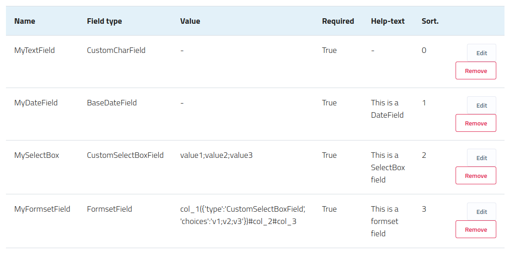
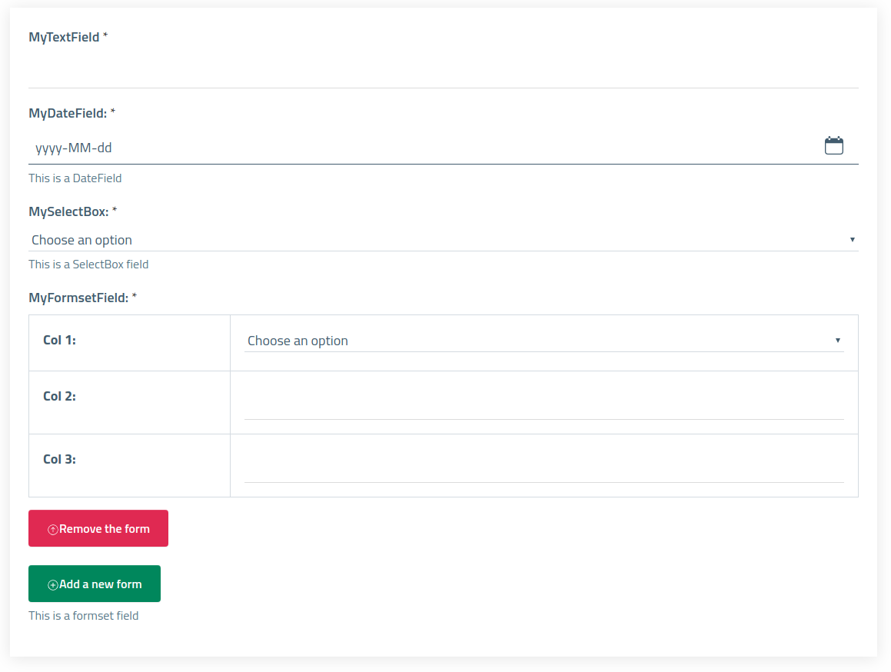

Django Form Builder
-------------------

A Django Framework application to build dynamic forms, with widgets and Django's standards, using JSON objects.

Forms can be saved in a configurable storage (or settings.py). Users that requires high levels of customization will find what they're look for.

Consult the [Official Documentation](https://django-form-builder.readthedocs.io/en/latest/index.html) at readthedocs for usage specifications and advanced topics.


_**Image 1:** Example of Dynamic Form built via frontend_


_**Image 2**: Preview of the builded form_

Features
--------

- Forms definitions via JSON object
- Save compiled form as JSON objects in model db and get its structure and contents with a simple model method call
- Override form constructor in order to add static common fields
- Create input fields using heritable classes, with customizable validation methods
- Manage [Django Formset](https://docs.djangoproject.com/en/2.2/topics/forms/formsets/) fields, with form insertion and removal via javascript;
- Manage and verify digitally signed file fields (PDF and P7M) without a certification authority validation (TODO via third-party API)
- Audio and Image Captcha

Examples
--------

Example of a dynamic form JSON in database

```json
{
  "field_1": "value_field_1",
  "field_2": "value_field_2",
  "field_3": "value_field_3",
  "attachments": {
    "p7m": "file_1.pdf.p7m",
    "pdf": "file_2.pdf"
  }
}
```

CaPTCHA
-------

In `settings.py` configure these parameters

````
CAPTCHA_SECRET = b'your_secret'
CAPTCHA_SALT = b'your_salt'
````

Tests
-----

````
# build a virtualend where to install all the requirements and requirements-dev ...
cd example
./manage.py test

# coverage
coverage erase
coverage run  ./manage.py test
coverage report -m
````


Build
-----

````
rm -R build/ dist/ *egg-info
python3 setup.py sdist
twine upload dist/*
````
